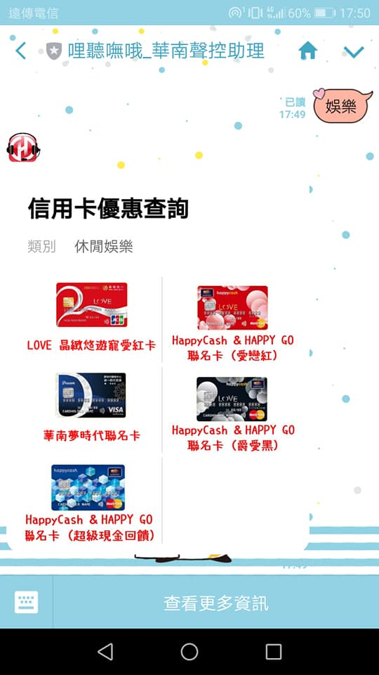

# line_costumed_reply

## Description
Template code of line customed reply message(flex message).

## How to use?
#### step 1. import package
```python 
from customer_template import create_customer_template
```
#### step 2. just reply customed message with two line!
for example:
```python
# this is the demo code of line message api
.
.
.
 # handle a event which receive a text msg
@handler.add(MessageEvent, message=TextMessage)
def handle_message(event):
    msg = event.message.text
    print('【receive type】', event.message.type)
    print('【text content】', msg)
    
    if msg == "娛樂":
        customer_template = create_customer_template()
        line_bot_api.reply_message(event.reply_token, customer_template)
        return
```
## Demo
<p align="center"></p>

## Detail
- [Using Flex Messages](https://developers.line.biz/en/docs/messaging-api/using-flex-messages/)
- [[Python] Line客製化回覆訊息](https://john850512.wordpress.com/2019/02/02/python-line%E5%AE%A2%E8%A3%BD%E5%8C%96%E5%9B%9E%E8%A6%86%E8%A8%8A%E6%81%AF/)
